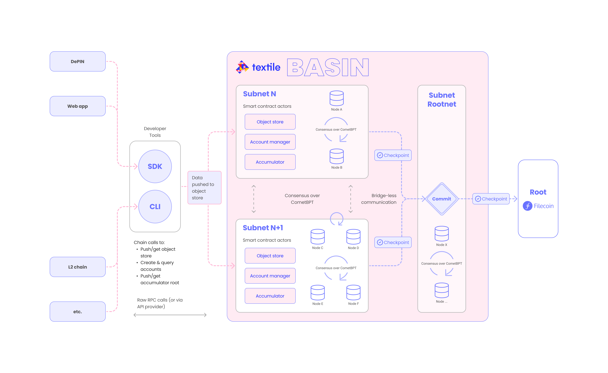

# Basin

> Basin network interfaces & tooling for scalable subnets & onchain data storage.

_Note_: Basin is referred to by our codename "ADM" throughout this repo.

## Table of Contents

- [Background](#background)
  - [Architecture](#architecture)
    - [IPC \& subnets](#ipc--subnets)
    - [CometBFT \& state replication](#cometbft--state-replication)
    - [ABCI \& Fendermint](#abci--fendermint)
    - [Consensus](#consensus)
  - [Machines (smart contracts)](#machines-smart-contracts)
    - [Machine manager](#machine-manager)
    - [Object store machine](#object-store-machine)
    - [Accumulator machine](#accumulator-machine)
  - [Accounts](#accounts)
  - [Access control](#access-control)
  - [Broadcast modes](#broadcast-modes)
- [Usage](#usage)
  - [Chain RPCs \& funds](#chain-rpcs--funds)
  - [Limits](#limits)
- [Development](#development)
- [Contributing](#contributing)
- [License](#license)

> [!CAUTION]
> The ADM is currently an alpha testnet, and the network is subject to fortnightly changes with rolling updates.
> Please be aware that the network may be reset at any time, and **data may be deleted every two weeks**.
> A more stable testnet will be released in the future that won't have this limitation.

## Background

Basin (referred to as the ADM throughout this repo) is a decentralized data layer, enabled by subnets that are purpose
built for onchain data storage.
It is built on top of the Filecoin Virtual Machine (FVM) and provides a horizontally scalable, verifiable, and
cost-effective data availability layer for onchain applications, networks (e.g., DePINs), and services.
The first _data Layer 2 (L2)_.
A handful of specialized "machines" for object storage and data anchoring
power the ADM's featured data services.

### Architecture

The ADM is developed using the Filecoin [InterPlanetary Consensus (IPC) framework](https://docs.ipc.space/). IPC is a
blockchain scaling solution and architectural design that is an alternative to existing L2 scaling solutions and
based on the design principles of on-demand horizontal scaling.

  

#### IPC & subnets

IPC allows for permissionless creation of new blockchain subsystems called _subnets_. Subnets are organized
hierarchically, enabling seamless internal communication and eliminating the need for cross-chain bridges. Each subnet
can employ its specific consensus algorithm and inherit security from parent subnets, and this structure facilitates
hosting or sharding applications based on performance or cost needs.

Operators of a subnet must run a full validator node for both the parent and the child subnet. The parent subnet is
responsible for the security of the child subnet, and the child subnet is responsible for its own consensus and state
transitions.

> [!NOTE]
> The ADM is currently a single child subnet rooted in its parent Filecoin Calibration testnet. Future versions of the
> ADM will align more closely with IPC's permissionless subnet spawning and configurable consensus mechanisms.

#### CometBFT & state replication

[CometBFT](https://docs.cometbft.com/v0.38/) (formerly known as _Tendermint_) helps the ADM achieve state machine
replication across all nodes in the network. Its consensus algorithm is based on a variant of Practical Byzantine Fault
Tolerance (PBFT) and relies on a round-robin proposer selection mechanism, while incorporating elements that improve on
PBFT's performance and communication overhead. It is a fast, battled-tested, and well-designed consensus engine.

You can consider CometBFT as a standalone process that issues commands
to [Fendermint](https://github.com/consensus-shipyard/ipc/tree/main/fendermint) and exposes a public JSON RPC API, much
like the Ethereum JSON RPC API.

#### ABCI & Fendermint

The ADM's blockchain functionality is exposed as a unified ABCI++ application controlled by CometBFT.

[Application Blockchain Interfaces (ABCI)](https://docs.cometbft.com/v0.38/spec/abci/) programs are an interface between
CometBFT and the actual state machine being replicated. That is, ABCIs implement deterministic state machines to be
securely replicated by the CometBFT consensus engine. The "++" in ABCI++ refers to additional functionality that
CometBFT enables compared to the original ABCI, which helps improve the overall scalability and feature surface area.

Fendermint is a specialized ABCI++ interface to the Filecoin Virtual Machines (FVM) and Ethereum-compatible FEVM. It
exposes FEVM/FVM-specific functionality within subnets, allowing the ADM subnets to behave like Filecoin but with custom
parameters to greatly improve throughput and features. Fendermint is also a standalone process that includes:

- **Interpreters:** Responsible for handling commands from CometBFT.
- **Snapshots:** CAR files that can be offered to peers for quick chain sync.
- **IPLD resolver:** A libp2p-based service that is used to resolve CIDs from IPFS as well as the network of validator
  peers. [IPLD](https://ipld.io/) powers the network's ability to store and retrieve data in a content-addressable way.

#### Consensus

Checkpoints that reference subset state are pushed to the parent subnet in a bottom-up fashion, which is essential for
the parent to validate the state transitions of the child. The ADM passes checkpointed headers to its parent and uses
the CometBFT ledger to gather relevant signatures and data. Additionally, the ADM can contact the IPLD resolver & store
to read and write data to its internal state so that it is IPLD addressable. There is also a _top-down_ sync action;
subnets must have a view of their parent's finality, which includes the latest block hash, power table information,
and (in the future) cross-subnetmessage passing.

In general, data is represented as CIDs onchain (within an ADM machine's state), and the actual data is stored offchain
in a node's local (networked) block store. The ADM uses the concept of a _detached payload_ asynchronous sync mechanism,
which is a transaction that includes a CID reference to an object, but does not include the object data itself. When a
detached payload is added to the chain, validators are required to download the object data from the network and verify
that it matches the CID reference. This ensures that all validators have a copy of the object data and can verify the
integrity of the object store state.

The core IPC process for top-down parent finality is a vote-based mechanism. Once a validator has the data locally (via
synchronization with its peers), the validator issues a _vote_ to the other validators to confirm data availability
(this is similar to Ethereum's concept of
a [data availability committee](https://ethereum.org/en/developers/docs/data-availability/#data-availability-committees)).
During this time, normal block production continues. The leader of a given consensus round checks the vote tally for
quorum based on the power table (stake) within the subnet. If a quorum is reached, the leader injects a synthetic
transaction into the proposal, which is validated by the other validators based on their view of the vote tally, and
then finally during execution of this transaction, the object is marked as `resolved`.

### Machines (smart contracts)

The ADM's core functionality is enabled with a series of data machines, which are synonymous with smart contracts or
"actors" that run on the FVM and are used to manage, query, and update the state of the subnet. The FVM is responsible
for executing the logic of the ADM protocol, including processing transactions, updating account balances, and managing
the state of the network. There are three primary machines in the ADM:

- Machine manager
- Object store machines
- Accumulator machines

The FVM executes messages in WASM over machine state and uses
the [Wasmtime](https://github.com/bytecodealliance/wasmtime)
runtime, and this includes a WASM implementation of the EVM bytecode interpreter. Under the hood, any "built-in" and
"custom" (unique / subnet-specific) smart contracts are compiled to CAR files and provided to the subnet during genesis.

#### Machine manager

Users are able to deploy new machines on-demand using the machine manager. This interface is responsible for creating
new object stores or accumulators and also managing the state of the network. Each machine is associated with a unique
address, which is used to identify the machine on the network.

#### Object store machine

These are key-value stores that allow you to push and retrieve data in a familiar S3-like fashion.
Object stores support byte range requests and advanced queries based on key prefix, delimiter, offset, and limit.
The object store machine provides a set of methods for interacting with the store, including `put`, `get`, and `delete`,
which allow users to store and retrieve data from the store.

Internally, the state of an object store is represented as
an [IPLD-based HAMT](ipns://ipld.io/specs/advanced-data-layouts/hamt/spec/) (hash array mapped trie). The IPLD data
model provides a flexible and extensible way to represent complex data structures.

#### Accumulator machine

An accumulator is a [Merkle Mountain Range (MMR)](https://docs.grin.mw/wiki/chain-state/merkle-mountain-range/)-based
verifiable anchoring system for state updates. You can push values up to 500KiB and retrieve them by index.
Accumulators support querying for state root, MMR peaks, and total leaf count.
As you push new data to the accumulator, you can retrieve the underlying data at a `leaf` or other relevant data
structure components like `peaks` and total `count`. Similar to the object store machine, the accumulator stores a
CID summary in its on-chain state.

### Accounts

Accounts (ECDSA, secp256k1) are used to send data-carrying transactions as you would on any blockchain system. Since the
ADM is built on top of Filecoin's FVM, the addresses follow a _slightly_ different convention than a purely EVM-based
account system. Here's a quick primer:

- Addresses are prefixed with a network identifier: `t` for Filecoin testnet, or `f` for Filecoin mainnet, and there are
  five different address types denoted by the second character in the address string: `t0`/`f0` to `t4`/`f4`.
- If you're coming from the EVM world, you'll mostly see two types in the ADM:
  - `t2`/`f2`: Any FVM-native contract that gets deployed, such as the object store and accumlator machines.
  - `t4`/`f4`: A namespaced contract address, and `t410`/`f410` is a specifalized namespace for Ethereum-compatible
    addresses (wallets _and_ smart contracts) on the FVM.
- Namely, each `t410...`/`f410...` address is equivalent to a `0x` address; the hex address
  is [encoded in the FVM address string](https://docs.filecoin.io/smart-contracts/filecoin-evm-runtime/address-types#converting-to-a-0x-style-address).

Once your EVM-style account is registered on a subnet, the `0x` and its corresponding `t410...`/`f410...` addresses can
be used interchangeably on Filecoin and all ADM subnets.

### Access control

Currently, there are two types of write-access controls: only-owner or public access.
For example, you can create an object store that you,
and _only_ you can write to — gated by signatures from your private key.
Or, you can have "allow all" access where anyone can write data.

This is being further refined, and there will be more robust access control mechanisms soon.

### Broadcast modes

For context, are three ways in which transactions can be sent/broadcasted to the network: `commit`, `sync`, and `async`.
Here's a quick overview of each:

- `commit`: Wait until the transaction is delivered and final (default behavior).
- `sync`: Wait only for the result of a local transaction pre-check, but don’t wait for it to be delivered to all
  validators (i.e., added risk the transaction may fail during delivery).
- `async`: Does not wait at all. You will not see errors in your terminal (i.e., added risk the transaction may fail
  during delivery).

## Usage

The ADM comes with both a CLI and Rust SDK that expose the core network interfaces.
You can find detailed instructions for each of these in their respective subdirectories:

- CLI: [here](./cli/README.md)
- SDK: [here](./sdk/examples/README.md)

### Chain RPCs & funds

Since the ADM is built on top of Filecoin, you must have FIL in your account to interact with the network. The ADM is
currently only live on the Filecoin Calibration network, so you can get tFIL via the
faucet [here](https://faucet.calibnet.chainsafe-fil.io/funds.html). For reference, Filecoin chain information can be
found [here](https://chainlist.org/?search=filecoin&testnets=true).

### Limits

There are a few limitations and behaviors of which to be aware when using the ADM network:

- The maximum size for a single object is 1 GiB.
- Objects that are less than or equal to 1024 bytes are "on-chain" objects that get stored fully onchain.
- Objects that are greater than 1024 bytes are "detached" objects that get stored offchain and resolved as a CID.
- The current throughput of the ADM is hundreds of transactions per second (TPS) (note: this is a rough estimate and may
  vary based on network conditions. The node design is still under heavy development, and optimizations are being made).

## Development

When developing against a local network, be sure to set the `--network` (or `NETWORK`) to `devnet`. This presumes you
have a local-only setup running, provided by the [`ipc`](https://github.com/textileio/ipc) repo and custom
contracts in [`builtin-actors`](https://github.com/textileio/builtin-actors).

All the available commands include:

- Build all crates: `make build`
- Install the CLI: `make install`
- Run tests: `make test`
- Run linter: `make lint`
- Run formatter: `make check-fmt`
- Run clippy: `make check-clippy`
- Do all of the above: `make all`
- Clean dependencies: `make clean`

## Contributing

PRs accepted.

Small note: If editing the README, please conform to
the [standard-readme](https://github.com/RichardLitt/standard-readme) specification.

## License

MIT OR Apache-2.0, © 2024 ADM Contributors
